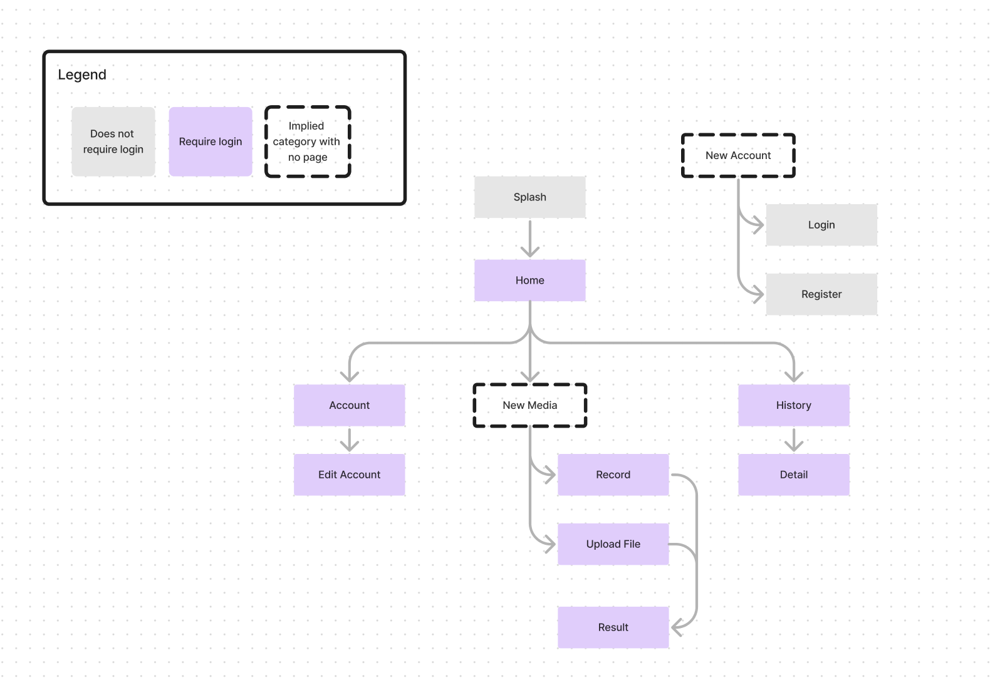

# User Experience Design

## Prototype
See [this link](https://www.figma.com/proto/ApTVXpwNunSDZ0xMmKlLoP/WireFrame?type=design&node-id=1-3&t=c2IwUUjxurxrj3OS-1&scaling=scale-down&page-id=0%3A1&starting-point-node-id=1%3A3&mode=design)

## App Map

## Wireframe Diagram

### Entire Wireframe Diagram

### Home

### Left Top Menu

### Login Page

### Register Page

### About Us

### Account Setting

### Home Page

### Record

### Upload

### History

### Recording Details

